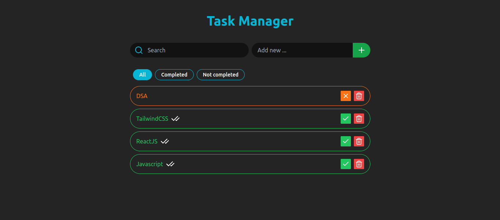

# Task Manager App

A lightweight and efficient Task Manager App built with **React** and **TypeScript**, designed to simplify task management. The app allows users to create, delete, and manage tasks with additional features like persistence and sorting for enhanced usability.

## Live Demo

You can view the live version of the application at:

[Live URL](https://task-manager-107.netlify.app/)

## Features

1. **Task Input**: Add tasks with a descriptive title.
2. **Task Deletion**: Remove tasks from the list.
3. **Task Persistence**: Save tasks in local storage to retain them across sessions.

## Tech Stack

- **Framework**: React
- **Language**: TypeScript

## Screenshots



## Getting Started

Follow the instructions below to set up the project locally.

### Prerequisites

Make sure you have the following installed:

- [Node.js](https://nodejs.org/) (v14.x or higher)
- [Yarn](https://yarnpkg.com/) or [npm](https://www.npmjs.com/)

### Installation

1. **Clone the repository:**

```bash
 git clone https://github.com/SunnyKumar107/task-manager
 cd task-manager
```

2. **Install dependencies.**

```bash
 npm install
 or
 yarn install
```

3. **Run the project.**

```bash
 npm run dev
 or
 yarn run dev
```
